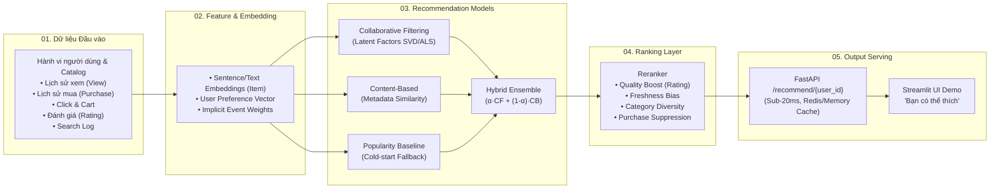

# 🛍️ RecSys-AI — Hệ Thống Gợi Ý Sản Phẩm Toàn Diện

> **Recommendation System** phân tích hành vi người dùng (view, click, cart, purchase, rating) để đề xuất sản phẩm tối ưu theo thời gian thực.
> Triển khai đầy đủ 7 giai đoạn kiến trúc từ **Data Pipeline & Hạ tầng** đến **Embedding, Multi-Model (Collaborative, Content-Based, Hybrid), Ranking, FastAPI Serving & Streamlit UI**.

---

## 📌 Sơ Đồ Kiến Trúc Pipeline (Bám sát thiết kế)



---

## 📂 Cấu Trúc Dự Án

```text
RecSys-AI/
├── data/
│   ├── raw/                 # Dữ liệu thô (MovieLens / RetailRocket)
│   ├── processed/           # Dữ liệu sạch sau chuẩn hóa
│   ├── embeddings/          # Vector embeddings được lưu trữ
│   └── recsys.db            # SQLite database mặc định (zero-setup)
├── docker/
│   ├── docker-compose.yml   # PostgreSQL (pgvector) + Redis
│   └── Dockerfile           # Container build cho FastAPI backend
├── src/
│   ├── config.py            # Quản lý cấu hình tập trung (Pydantic Settings)
│   ├── database/            # Schema ORM & Session management
│   │   ├── models.py        # Product, User, Interaction, SearchLog
│   │   └── session.py       # SQLAlchemy engine & session factory
│   ├── features/            # Trích xuất đặc trưng & Embedding
│   │   ├── text_embedder.py # Dense vector embedding từ metadata sản phẩm
│   │   └── user_profiler.py # Tạo vector sở thích người dùng từ lịch sử
│   ├── models/              # Các thuật toán Recommendation Core
│   │   ├── base.py          # Abstract Base Class
│   │   ├── baseline.py      # Popularity-Based Recommender (Cold-Start)
│   │   ├── content_based.py # Content-Based Filtering qua Cosine Similarity
│   │   ├── collaborative.py # Collaborative Filtering qua Matrix Factorization (SVD)
│   │   └── hybrid.py        # Hybrid Ensemble kết hợp trọng số & định tuyến cold-start
│   ├── ranking/             # Tầng Reranking & Đa mục tiêu
│   │   └── reranker.py      # Lọc sản phẩm vừa mua, boost rating, đa dạng hóa danh mục
│   ├── evaluation/          # Bộ công cụ đánh giá Offline Metrics
│   │   └── metrics.py       # Precision@K, Recall@K, NDCG@K, MAP@K, Coverage
│   ├── api/                 # FastAPI RESTful Serving Gateway
│   │   ├── main.py          # Khởi chạy app & Lifespan pretraining
│   │   ├── routes.py        # Endpoints: /recommend, /similar, /interact, /products
│   │   ├── schemas.py       # Pydantic schemas I/O
│   │   └── cache.py         # Caching layer (Redis + Memory TTL)
│   └── ui/                  # Giao diện Web Trực quan
│       └── app.py           # Streamlit Web App "Bạn có thể thích"
├── tests/                   # 100% Automated Pytest Suite
│   ├── test_database.py     # Test ORM và quan hệ bảng
│   ├── test_models.py       # Test 4 mô hình gợi ý + kịch bản cold-start
│   ├── test_reranker.py     # Test bộ lọc chống trùng và xếp hạng
│   └── test_api.py          # Test toàn bộ API endpoints
├── scripts/
│   ├── generate_seed_data.py # Sinh dữ liệu mẫu thương mại điện tử thực tế
│   ├── evaluate_models.py    # Chạy benchmark offline so sánh 4 mô hình
│   └── download_dataset.py   # Tải dataset MovieLens-100k tự động
├── requirements.txt         # Quản lý thư viện phụ thuộc
├── pytest.ini               # Cấu hình pytest
└── README.md
```

---

## 🚀 Hướng Dẫn Cài Đặt & Chạy Nhanh

### 1. Khởi tạo môi trường ảo & cài đặt thư viện
```bash
# Tạo môi trường ảo với Python 3.11 (khuyên dùng uv)
uv venv --python 3.11 .venv
source .venv/bin/activate

# Cài đặt toàn bộ dependencies
uv pip install -r requirements.txt
```

### 2. Khởi tạo Database & Dữ liệu mẫu (Seed Data)
Tạo cơ sở dữ liệu SQLite cục bộ cùng 31 sản phẩm mẫu đa ngành hàng, 150 người dùng với các persona khác nhau (Tech Geek, Sneakerhead, Smart Home, Newbie...), và hơn 4,000 sự kiện tương tác thực tế:
```bash
python -m scripts.generate_seed_data
```

### 3. Chạy Kiểm thử Tự động (Pytest)
```bash
pytest tests/ -v
```
*(Đảm bảo 14/14 tests pass 100%).*

### 4. Đánh giá Benchmark các Mô hình (Offline Metrics)
Chạy script chia tập train/test (80/20) để đo lường `Precision@5`, `Recall@5`, `NDCG@5`, và `Catalog Coverage`:
```bash
python -m scripts.evaluate_models
```

### 5. Khởi chạy FastAPI Backend Server
```bash
uvicorn src.api.main:app --host 0.0.0.0 --port 8000 --reload
```
- **Swagger UI Interactive Docs**: [http://localhost:8000/docs](http://localhost:8000/docs)
- **API gợi ý Top-K**: `GET http://localhost:8000/api/v1/recommend/{user_id}?top_k=8&strategy=hybrid`
- **API ghi nhận tương tác Realtime**: `POST http://localhost:8000/api/v1/interact`

### 6. Khởi chạy Giao diện Trực quan (Streamlit App)
```bash
streamlit run src.ui.app.py
```
Giao diện trực quan sẽ mở tại [http://localhost:8501](http://localhost:8501):
- Chọn người dùng để xem gợi ý cá nhân hóa.
- Chọn người dùng mới (Cold-Start Newbie) để thấy hệ thống tự động fallback sang Popularity / Content-Based.
- Bấm **👁️ Xem**, **🛒 Thêm giỏ**, hoặc **💳 Mua ngay** trên từng card sản phẩm để trải nghiệm cập nhật thời gian thực (Real-time closed-loop)!

---

## 📡 Chi Tiết Các API Endpoints

| Phương thức | Endpoint | Mô tả |
|---|---|---|
| `GET` | `/` | Trạng thái hệ thống và metadata |
| `GET` | `/api/v1/health` | Kiểm tra sức khỏe, số lượng sản phẩm, user, event trong DB |
| `GET` | `/api/v1/recommend/{user_id}` | Lấy Top-K gợi ý (`strategy`: `hybrid`, `collaborative`, `content_based`, `popularity`) |
| `GET` | `/api/v1/similar-products/{product_id}` | Gợi ý sản phẩm tương đồng (Item-to-Item Content Filtering) |
| `POST` | `/api/v1/interact` | Ghi nhận tương tác mới (`view`, `click`, `add_to_cart`, `purchase`, `rating`) |
| `GET` | `/api/v1/products` | Liệt kê danh mục sản phẩm (hỗ trợ lọc theo `category`, `search`) |
| `GET` | `/api/v1/users` | Danh sách người dùng mẫu và số lượng tương tác |

---

## 🐳 Triển Khai Với Docker & Docker Compose (Production)

Để chạy hệ thống với cụm **PostgreSQL (pgvector) + Redis + FastAPI Serving**:
```bash
docker-compose -f docker/docker-compose.yml up --build -d
```

---

## 💡 Đúc Kết Kỹ Thuật (Key Architectural Takeaways)

1. **Xử lý Triệt để Cold-Start**:
   - Khi User mới tinh (0 tương tác): Fallback mượt mà sang `PopularityRecommender` dựa trên xu hướng sản phẩm.
   - Khi User có 1–2 click đầu tiên: Hệ thống chuyển dần sang `Content-Based Filtering` theo embedding nội dung vừa xem.
   - Khi User có đủ lịch sử: Kích hoạt `Hybrid Ensemble` kết hợp Collaborative Filtering để khai phá sở thích bất ngờ (*serendipity*).
2. **Reranker Đa Mục Tiêu (Multi-Objective Ranking)**:
   - Loại bỏ các sản phẩm user vừa mới mua gần đây (chống gây khó chịu).
   - Tăng cường tỷ trọng sản phẩm có điểm đánh giá trung bình cao và sản phẩm mới ra mắt.
   - Ràng buộc đa dạng hóa danh mục (tối đa 3 sản phẩm/danh mục trong Top-K) để tránh ngập lụt một chủng loại.
3. **Cơ chế Caching 2 Lớp (Sub-20ms Serving)**:
   - Hỗ trợ Redis khi chạy phân tán và In-Memory LRU Cache khi chạy độc lập.
   - Tự động xóa cache của User ngay khi phát sinh event tương tác mới qua `/interact`.
