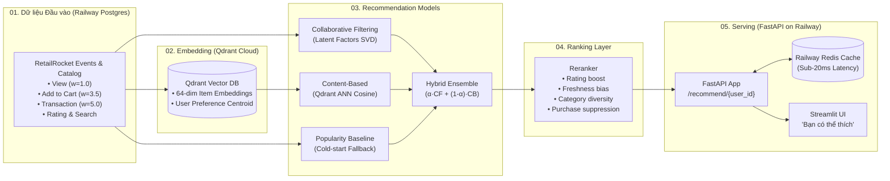

# 🛍️ RecSys-AI — Hệ Thống Gợi Ý Sản Phẩm Toàn Diện

> **Recommendation System** phân tích hành vi người dùng (view, click, cart, purchase, rating) để đề xuất sản phẩm tối ưu theo thời gian thực.
> Tích hợp trọn bộ stack hiện đại sẵn sàng deploy: **Railway (FastAPI + PostgreSQL + Redis) + Qdrant Cloud Free Tier (Vector DB) + RetailRocket Dataset (Kaggle)**.

---

## ⚡ Stack Công Nghệ Đã Chốt

| Thành phần | Công nghệ / Dịch vụ | Vai trò & Mục đích |
|---|---|---|
| **API Serving Backend** | **FastAPI** on **Railway** | Endpoint `/recommend/{user_id}`, sub-20ms latency, autoscale |
| **Relational Database** | **PostgreSQL** on **Railway** | Lưu trữ quan hệ: Catalog, User profiles, Interaction logs, Search logs |
| **Database Migrations** | **Alembic** | Quản lý version schema DB, auto migrate khi deploy (`alembic upgrade head`) |
| **Cache & Realtime State**| **Redis** on **Railway** | Caching Top-K recommendations, session cache, auto-invalidation |
| **Vector Database** | **Qdrant Cloud Free Tier** | Lưu trữ embeddings và truy vấn Approximate Nearest Neighbors (ANN) Cosine Search |
| **Dataset Chuẩn** | **RetailRocket (Kaggle)** | Dữ liệu e-commerce thực tế: `events.csv`, `item_properties.csv` |
| **Demo UI** | **Streamlit** | Giao diện tương tác trực quan "Bạn có thể thích", realtime click/buy feedback loop |

---

## 📌 Sơ Đồ Kiến Trúc Pipeline 5 Khối



---

## 📂 Cấu Trúc Dự Án

```text
RecSys-AI/
├── alembic/                 # Quản lý Database Migrations
│   ├── versions/            # File migration revisions (001_initial_schema.py)
│   └── env.py               # Tự động đọc DATABASE_URL từ Railway/settings
├── alembic.ini              # File config gốc Alembic
├── docker/
│   ├── docker-compose.yml   # Chạy local full cụm Postgres + Redis
│   └── Dockerfile           # Docker container tối ưu cho Railway deployment
├── Procfile                 # Start command cho Railway PaaS
├── railway.json             # Cấu hình build Nixpacks và deploy trên Railway
├── data/
│   ├── raw/retailrocket/    # Dataset RetailRocket (events.csv, item_properties.csv)
│   ├── processed/
│   └── embeddings/
├── src/
│   ├── config.py            # Cấu hình biến môi trường (Pydantic Settings)
│   ├── database/
│   │   ├── models.py        # SQLAlchemy ORM (Product, User, Interaction, SearchLog)
│   │   └── session.py       # Engine & Session pool hỗ trợ Postgres / SQLite
│   ├── services/
│   │   └── qdrant_service.py # Adapter kết nối Qdrant Cloud và ANN Vector Search
│   ├── features/
│   │   ├── text_embedder.py # Dense vector embeddings từ metadata sản phẩm
│   │   └── user_profiler.py # Tạo vector hồ sơ người dùng từ lịch sử
│   ├── models/
│   │   ├── base.py          # Abstract Recommender
│   │   ├── baseline.py      # Popularity Recommender (Cold-Start fallback)
│   │   ├── content_based.py # Content-Based Filter (Tích hợp Qdrant ANN)
│   │   ├── collaborative.py # Collaborative Filtering (Matrix Factorization SVD)
│   │   └── hybrid.py        # Hybrid Ensemble kết hợp đa thuật toán
│   ├── ranking/
│   │   └── reranker.py      # Bộ lọc chống trùng mua, boost rating, đa dạng hóa
│   ├── evaluation/
│   │   └── metrics.py       # Precision@K, Recall@K, NDCG@K, MAP@K, Coverage
│   ├── api/
│   │   ├── main.py          # FastAPI Lifespan & App entrypoint
│   │   ├── routes.py        # Endpoints /recommend, /similar, /interact, /products
│   │   ├── schemas.py       # Pydantic v2 schemas
│   │   └── cache.py         # Caching 2 lớp (Railway Redis + Memory fallback)
│   └── ui/
│       └── app.py           # Streamlit demo sàn thương mại điện tử
├── tests/                   # 15/15 Automated Pytest Test Suite
│   ├── test_api.py
│   ├── test_database.py
│   ├── test_models.py
│   ├── test_qdrant.py
│   └── test_reranker.py
├── scripts/
│   ├── ingest_retailrocket.py # ETL dataset RetailRocket -> Postgres & Qdrant
│   ├── generate_seed_data.py  # Sinh mock data chuẩn
│   ├── evaluate_models.py     # Đo lường offline metrics 4 mô hình
│   └── download_dataset.py    # Tải MovieLens 100k
├── requirements.txt         # Quản lý dependencies (đã gồm qdrant-client, psycopg2)
├── pytest.ini
└── README.md
```

---

## 🚀 Hướng Dẫn Vận Hành Cục Bộ (Local Development)

### 1. Cài đặt môi trường
```bash
cd /Users/mainguyenbinhtan/Downloads/RecSys-AI
source .venv/bin/activate
uv pip install -r requirements.txt
```

### 2. Chạy Database Migration với Alembic
```bash
alembic upgrade head
```

### 3. Ingest Dữ liệu RetailRocket vào Database & Qdrant
```bash
python -m scripts.ingest_retailrocket
```

### 4. Chạy toàn bộ Test Suite (15 tests)
```bash
pytest tests/ -v
```

### 5. Khởi chạy Giao diện Demo Streamlit
```bash
streamlit run src/ui/app.py
```
*(Mở tại [http://localhost:8501](http://localhost:8501))*

### 6. Khởi chạy FastAPI Server
```bash
uvicorn src.api.main:app --port 8000 --reload
```
*(Swagger UI Docs tại [http://localhost:8000/docs](http://localhost:8000/docs))*

---

## ☁️ Hướng Dẫn Deploy Lên Railway & Qdrant Cloud

### Bước 1: Tạo cụm Vector DB trên Qdrant Cloud (Miễn phí)
1. Đăng ký tài khoản tại [https://cloud.qdrant.io](https://cloud.qdrant.io).
2. Tạo 1 **Free Cluster** (1GB RAM miễn phí trọn đời).
3. Lấy **Cluster URL** (dạng `https://xxxx.eu-central.aws.cloud.qdrant.io:6333`) và **API Key**.

### Bước 2: Deploy lên Railway (Postgres + Redis + FastAPI)
1. Truy cập [https://railway.app](https://railway.app) và bấm **New Project**.
2. Chọn **Provision PostgreSQL** $\rightarrow$ Railway sẽ tự cấp phát một cơ sở dữ liệu PostgreSQL.
3. Chọn **Add a Service** $\rightarrow$ **Database** $\rightarrow$ **Redis** $\rightarrow$ Railway sẽ tự cấp phát một cụm Redis cache.
4. Chọn **Add a Service** $\rightarrow$ **GitHub Repo** $\rightarrow$ Chọn repository `RecSys-AI`:
   - Railway sẽ tự động nhận diện `railway.json` / `Procfile` / `Dockerfile`.
   - Vào tab **Variables** của service App và thêm các biến:
     ```bash
     # Railway tự động inject DATABASE_URL và REDIS_URL từ Postgres & Redis cùng project
     DATABASE_URL=${{Postgres.DATABASE_URL}}
     REDIS_URL=${{Redis.REDIS_URL}}

     # Điền credentials từ Qdrant Cloud:
     QDRANT_URL=https://your-cluster-id.cloud.qdrant.io:6333
     QDRANT_API_KEY=your_qdrant_api_key
     QDRANT_COLLECTION_NAME=product_embeddings
     VECTOR_DIMENSION=64
     ```
5. Bấm **Deploy**. Railway sẽ tự động:
   - Chạy lệnh `alembic upgrade head` để khởi tạo bảng dữ liệu trên Postgres.
   - Kết nối tới Redis cache.
   - Khởi động FastAPI server tại cổng `$PORT`.
